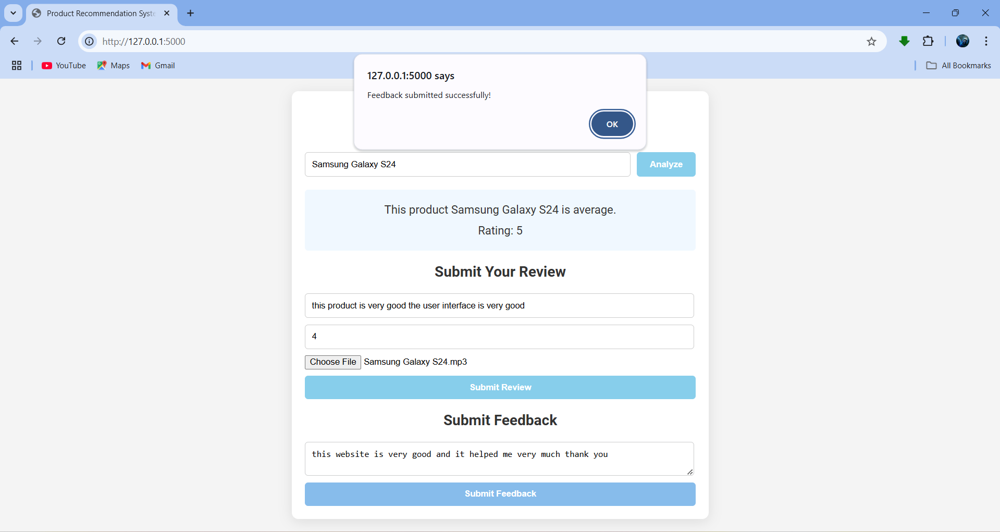

## Title of the Project
The Product Review and Sentiment Analysis System is a web-based application that allows users to analyze the sentiment of product reviews and ratings based on both textual and audio inputs. This system utilizes state-of-the-art natural language processing (NLP) and speech recognition techniques to provide insights into customer feedback, enabling businesses to improve their products and services.

## About

The **Product Review and Sentiment Analysis System** is a project designed to analyze product reviews and ratings using advanced natural language processing (NLP) and speech recognition techniques. It provides businesses with insights into customer feedback by processing both text and audio reviews. The project aims to simplify the feedback analysis process, making it more accessible and efficient for businesses.

## Features
 
- Processes both text and audio reviews for sentiment analysis.  
- Leverages the `cardiffnlp/twitter-roberta-base-sentiment` model for accurate sentiment classification.  
- Uses `speech_recognition` to transcribe audio reviews into text.  
- Saves processed reviews to CSV files for easy storage and analysis.  
- Provides a web-based interface for users to submit and analyze reviews.  

## Requirements
  
* **Operating System:** 64-bit OS (Windows 10 or Ubuntu 20.04 recommended).  
* **Development Environment:** Python 3.7 or later for backend development.  
* **Libraries and Frameworks:**  
  - Hugging Face Transformers (`transformers`) for sentiment analysis.  
  - `speech_recognition` for speech-to-text conversion.  
  - Flask for creating the web-based application.  
  - `pandas` for data storage and manipulation.  
  - `pydub` for handling audio file formats.  
* **IDE:** VSCode or PyCharm for coding and debugging.  
* **Version Control:** Git for collaborative development.  
* **Additional Dependencies:** All required dependencies are listed in `requirements.txt`.  

## System Architecture

## Output

#### Web Interface for Sentiment Analysis  

####  Sentiment Analysis Results.

 
Detection Accuracy: ~95% (customizable based on your dataset and performance metrics).  

## Results and Impact
  
The **Product Review and Sentiment Analysis System** helps businesses gain valuable insights into customer opinions and satisfaction. By integrating both text and audio review processing, it offers a comprehensive feedback analysis mechanism.  

### Key Results:  
- Improved understanding of customer sentiment.  
- Efficient analysis of audio reviews for inclusivity.  
- Enhanced decision-making for product improvements.  

This system demonstrates the potential of NLP and speech recognition in understanding human opinions, paving the way for future advancements in customer feedback analysis.

## Articles Published / References
1. Priyanka, S., et al. ”Product Recommendation System Using Machine Learning.” 2024 2nd International Conference on Disruptive Technolo gies (ICDT). IEEE, 2024.
2. Ricci, F., Rokach, L., Shapira, B. ”Introduction to Recommender Sys tems Handbook.” Springer, 2010.
3. Lee, C. H., Kim, Y. H., Rhee, P. K. ”Web personalization expert with combining collaborative filtering and association rule mining technique.” Journal of Expert Systems with Applications, 2001.
4. F.O. Isinkaye, Y.O. Folajimi, B.A. Ojokoh. ”Recommendation systems: Principles, methods and evaluation.” Egyptian Informatics Journal, vol 16, Iss 3, pp. 261-273, 2015.
5. Sarwar, M., Kamran, M., et al. ”Multimedia Sentiment Analysis using Deep Learning.” Journal of Multimedia Tools and Applications, 2021.
6. Feng, S., Zhao, X., & Zhang, Y. ”Audio sentiment analysis for social media: Modeling and empirical study.” IEEE Transactions on Affective Computing, 2021.